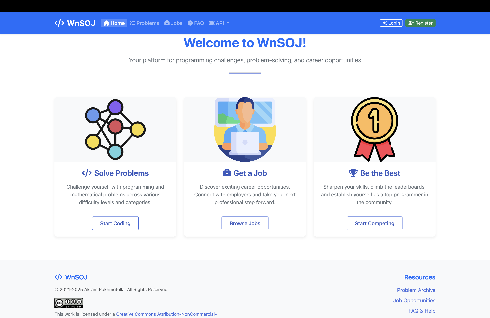

# WnSOJ - Work and Solve online judge! 
WnSOJ is a platform where you can solve programming and math tasks, learn new algorithms and concepts and find job. Platform offers `effective testing system`, `categorized problemset`, `editorials and solutions`, `submissions`, `job search`, `users` and `statistics`.

### Check it out at [wnsoj.xyz](https://wnsoj.xyz)!



## Architecture (Current)
- **Backend**: Django + Django REST Framework (DRF) + Celery (judge workers)
- **Frontend**: Next.js (App Router) in `frontend/` (Tailwind UI)
- **Auth (browser)**: Django **session cookies** (`sessionid`) + **CSRF** (`csrftoken`) — no JWT, no localStorage
- **Internal API**: Django `/api/*` is **not public** and is protected by a shared secret header (`X-Internal-API-Key`)
  - Next.js server-side requests include the internal key automatically
  - Browser-side mutations go through Next.js route handlers under `/backend/*`, which proxy to Django and attach the internal key

## Getting Started
### Backend (Django)
1. Clone:
```shell
git clone https://github.com/spike1236/WnSOJ.git
cd WnSOJ
```
2. Create a virtualenv (recommended) and install Python deps:
```shell
python3 -m venv .venv
source .venv/bin/activate
pip install -r requirements.txt
```
3. Install runtime requirements:
   - `g++` (with `-std=c++23` support; GCC 13+ recommended)
   - `python3.12`
   - [`isolate`](https://github.com/ioi/isolate) (cgroups v2-based)
4. Create `.env` from `.env.template` and fill in values:
   - `SECRET_KEY`, `DEBUG`, DB settings
   - `INTERNAL_API_KEY` (shared with Next.js)
   - `CSRF_TRUSTED_ORIGINS` (include your local/prod frontend origin, e.g. `http://127.0.0.1:8081` if you proxy through nginx)
5. Apply migrations (and optionally create an admin user):
```shell
python3 manage.py migrate
python3 manage.py createsuperuser
```
6. Run:
```shell
python3 manage.py runserver
celery -A app worker -l info
```
Open `http://127.0.0.1:8000` (Django-rendered pages) or start the Next.js frontend (below).

### Frontend (Next.js)
In a separate terminal:

```shell
cd frontend
npm install
BACKEND_ORIGIN=http://localhost:8000 INTERNAL_API_KEY=dev-secret npm run dev
```

Open `http://localhost:3000`.

Notes:
- `INTERNAL_API_KEY` must match the Django `INTERNAL_API_KEY` in `.env`.
- In dev, Next.js will proxy `/admin/`, `/static/`, `/media/` to Django. Browser API calls use `/backend/*` route handlers.

## Deployment
See [DEPLOY.md](./DEPLOY.md).

## About Project
### Problems and submissions
Platform provides an extensive set of olympiad programming tasks. To submit solution you need to be signed in system. You can register or sign in into existing account and submit solutions to problems. The testing system runs in parallel with server using Celery worker. You can use Redis, RabbitMQ or Amazon SQS as a broker for Celery worker (more info [here](https://docs.celeryq.dev/en/stable/getting-started/backends-and-brokers); personally, I use [Redis](https://redis.io/)).
System will automatically test your solution in isolated sandboxes provided by [isolate](https://github.com/ioi/isolate) and report verdict, max used time and max used memory.\
Also, each problem has editorial and solution in C++ language.\
Platform administrators can add new problems.
### Jobs
In the platform you can also find or publish/edit/delete job.
There are 2 types of accounts:
1. Common account - these users can find job and communicate with employers by email or phone.\
   Open job that you liked, read the description and if job suits you, communicate with employer by email or phone.
2. Business account - these users or companies can publish, edit or delete jobs, also find and communicate by email or phone with other users.\
   Publish job, edit it if it is need, and just wait until some qualified specialist will communicate with you by email or phone number.
### Profile
In the profile, you can see user's username and statistics about problems: submissions statistics and last 10 attempts. Email and phone number are shown only on your own profile.\
Also you can change your icon or password in 'Edit profile' page.
### Internal API (Not Public)
The Django REST endpoints under `/api/*` are intended for **internal use** (Next.js server + nginx private connectivity) and are protected by `INTERNAL_API_KEY`. Requests without the correct `X-Internal-API-Key` receive `404`.

The browser should talk only to the Next.js app. Client-side mutations use Next.js `/backend/*` route handlers which proxy to Django and attach the internal key.

## Deployment (Nginx)
Recommended approach:
- Public: Next.js on `/`
- Public: Django on `/admin/`, `/static/`, `/media/`
- Do **not** expose Django `/api/` publicly (it is protected, but should still be treated as internal-only)

Set env vars:
- Django: `INTERNAL_API_KEY`
- Next.js: `BACKEND_ORIGIN` (internal Django origin) and `INTERNAL_API_KEY` (same value)

## Technologies
Following technologies and libraries were used to create this project:
* [Django](https://www.djangoproject.com)
* [Django REST Framework](https://www.django-rest-framework.org)
* [Celery](https://docs.celeryq.dev/en/stable)
* [Next.js](https://nextjs.org)
* [PostgreSQL](https://www.postgresql.org)
* [isolate](https://github.com/ioi/isolate)
* [Redis](https://redis.io)
* [Pillow](https://pillow.readthedocs.io/en/stable)
* [ZipFile](https://docs.python.org/3/library/zipfile.html)
* [io](https://docs.python.org/3/library/io.html)
## Components (CSS and JS)
Following components were used to create this project:
* [Bootstrap](https://getbootstrap.com)
* [CodeMirror](https://codemirror.net)
* [marked](https://marked.js.org)
* [katex](https://katex.org)
* [FontAwesome](https://fontawesome.com)
* [Tailwind CSS](https://tailwindcss.com)

## Author
* **Rakhmetulla Akram** - [spike1236](https://github.com/spike1236)
## License
This work is licensed under a [Creative Commons Attribution-NonCommercial-ShareAlike 4.0 International License](https://creativecommons.org/licenses/by-nc-sa/4.0).\
See [LICENSE](./LICENSE.md) file for details.
